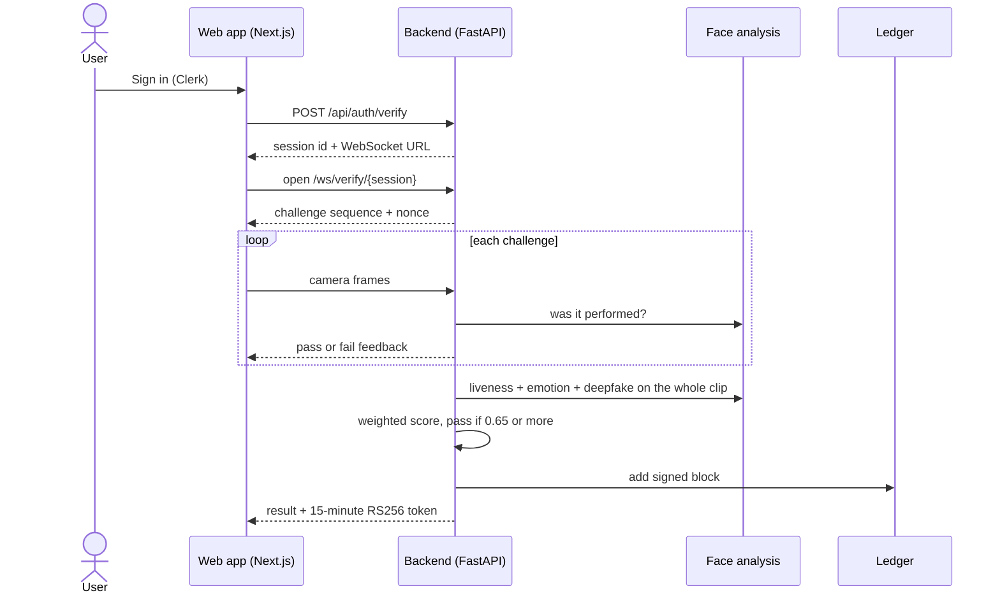

<div align="center">

# Sentinel

### Proof-of-life authentication: are you a live person, right now?

_A short webcam challenge checks for a real, present face, and a signed result and a tamper-evident log record the outcome._

[](LICENSE)


[Quickstart](#quickstart) · [How it works](#how-it-works) · [Methodology](./METHODOLOGY.md) · [Security](#security) · [Project status](#project-status) · [Report an issue](https://github.com/ArrinPaul/Sentinel/issues)

</div>

---

## About

Passwords and one-time codes prove that someone knows a secret. Sentinel asks a different question: is a live human in front of the camera right now, not a photo, a replayed video or a deepfake?

After signing in, the user is given a short, random set of challenges (for example "turn your head left", "smile", "blink"). The browser streams webcam frames to a FastAPI backend over a WebSocket. The backend checks that each challenge was done, measures how "alive" the face looks (3D depth cues and natural micro-movements), looks for signs of synthetic video and scores how natural the expressions are. If the combined score reaches the pass mark, it issues a short-lived signed token and writes the result into a signed, hash-chained log that anyone can verify.

**Who it's for:** developers and students exploring liveness detection, anti-spoofing and tamper-evident audit logs.

> **Read [Project status](#project-status) first.** As published, the backend does not start from a fresh clone because one Python package was never committed. This is a research prototype and must not be used to protect anything real.

## Table of Contents

1. [About](#about)
2. [Features](#features)
3. [How it works](#how-it-works)
4. [Quickstart](#quickstart)
5. [Configuration](#configuration)
6. [API overview](#api-overview)
7. [Tech stack](#tech-stack)
8. [Project structure](#project-structure)
9. [Security](#security)
10. [Testing](#testing)
11. [Project status](#project-status)
12. [Troubleshooting](#troubleshooting)
13. [Documentation](#documentation)
14. [Contributing](#contributing)
15. [License](#license)

## Features

| Area | What it does |
| :--- | :--- |
| **Random challenges** | 3 challenges per session, each a gesture (10 types, such as nod, turn, tilt, open mouth, blink) or an expression (5 types), chosen with a cryptographic random generator and tied to a one-time nonce |
| **Liveness check** | Scores 3D facial depth cues and natural micro-movements (blinks, tiny head motion, landmark jitter) from MediaPipe face landmarks |
| **Deepfake check** | A small neural network (MesoNet-style) if a model file is present, otherwise classic image analysis (frequency patterns, warping, color and edge consistency) |
| **Emotion check** | Scores how natural the expressions and transitions are, using DeepFace if installed |
| **Weighted decision** | Liveness 40%, deepfake 25% and emotion 35%, with a pass mark of 0.65 |
| **Signed token** | On success, an RS256 token valid for 15 minutes |
| **Audit ledger** | A hash chain of verification events, each block signed with RSA, with endpoints to inspect and verify it |
| **Sessions and limits** | A 120-second session limit and a limit of 3 consecutive failures |
| **Web app** | Next.js front end with Clerk sign-in, a verification screen, a ledger explorer and a profile page |

## How it works



The formulas, thresholds and fallbacks are in [METHODOLOGY.md](./METHODOLOGY.md).

## Quickstart

> The backend currently needs a file that is missing from the repository (see [Project status](#project-status)). The steps below show how it is meant to run.

Prerequisites: Python 3.11, Node.js 18+, a webcam, and a free [Clerk](https://clerk.com) application (optional for local development).

```bash
git clone https://github.com/ArrinPaul/Sentinel.git
cd Sentinel
```

**Backend**

```bash
cd backend
python -m venv venv
venv\Scripts\activate              # macOS/Linux: source venv/bin/activate
pip install -r requirements.txt
python download_mediapipe_model.py # downloads the face landmark model
cp .env.example .env               # then edit it (see Configuration)
uvicorn app.main:app --reload --port 8000
```

Do not use the committed `backend/venv311/` folder. It is a Windows virtual environment that was added to the repository by mistake and will not work on your machine.

**Frontend**

```bash
cd frontend
npm install
cp .env.local.example .env.local   # add your Clerk keys and API URLs
npm run dev                        # http://localhost:3000
```

Optional: `python download_deepfake_model.py` fetches a deepfake model, and `pip install deepface` enables the emotion check (see [Methodology](./METHODOLOGY.md) for what happens without them).

`start-local.bat` starts both servers on Windows, but it activates the committed `venv311` folder, so edit it to use your own virtual environment.

## Configuration

**Backend (`backend/.env`)**

| Variable | Purpose |
| :--- | :--- |
| `CLERK_ISSUER_URL` | Your Clerk issuer. If empty, token checks are skipped (development only). |
| `MEDIAPIPE_MODEL_PATH` | Face landmark model file. If unset, `~/.mediapipe_models/face_landmarker.task` is tried. |
| `DEEPFAKE_MODEL_PATH` | Optional deepfake model file. Without it, the image-analysis fallback is used. |
| `CORS_ORIGINS` | Allowed web origins, comma separated (default `http://localhost:3000`) |
| `JWT_PRIVATE_KEY`, `JWT_PUBLIC_KEY` | PEM text of the RSA key pair used for tokens and ledger blocks. If unset, a pair is generated at start-up. |
| `USE_WSS`, `WEBSOCKET_HOST` | Protocol and host put in the WebSocket URL sent to the browser |

`backend/.env.example` also lists `JWT_SECRET_KEY`, `JWT_ALGORITHM`, `JWT_EXPIRY_MINUTES`, `SESSION_TIMEOUT_SECONDS`, `MAX_FAILED_ATTEMPTS`, `HOST` and `PORT`. The running app does not read these. The limits are fixed in code (a 120-second session and 3 consecutive failures, and tokens that last 15 minutes). Start the server with `uvicorn ... --host --port` instead of `HOST` and `PORT`.

**Frontend (`frontend/.env.local`)**

| Variable | Purpose |
| :--- | :--- |
| `NEXT_PUBLIC_CLERK_PUBLISHABLE_KEY`, `CLERK_SECRET_KEY` | Clerk keys |
| `NEXT_PUBLIC_API_URL`, `NEXT_PUBLIC_WS_URL` | Backend HTTP and WebSocket addresses |

Never commit `.env` files.

## API overview

| Method and path | Purpose |
| :--- | :--- |
| `GET /health` | Liveness check |
| `POST /api/auth/verify` | Start a verification session (needs a Clerk token when `CLERK_ISSUER_URL` is set) |
| `WS /ws/verify/{session_id}` | Challenge and frame streaming |
| `POST /api/token/validate` | Check a token issued after a successful verification |
| `GET /api/blockchain/stats`, `chain`, `block/{n}`, `verify`, `verify/{n}`, `proof/{n}`, `session/{id}`, `public-key`, `lookup/{id}` | Inspect and verify the audit ledger |

## Tech stack

| Layer | Technology |
| :--- | :--- |
| Backend | Python 3.11, FastAPI, Uvicorn, WebSockets. Sessions and audit logs are held in memory, and the ledger is saved to a JSON file. |
| Vision | MediaPipe face landmarker, OpenCV, NumPy, optional TensorFlow (deepfake model) and DeepFace (emotion) |
| Crypto | PyJWT and `cryptography` (RS256 tokens, RSA-signed ledger blocks) |
| Frontend | Next.js 14, React 18, TypeScript, Tailwind CSS, Framer Motion, Clerk |
| Testing | Pytest, Hypothesis, Vitest, fast-check |

## Project structure

```text
Sentinel/
├── backend/
│   ├── app/
│   │   ├── main.py             FastAPI app, WebSocket flow, ledger endpoints
│   │   ├── config.py           Settings
│   │   └── services/           challenge_engine, cv_verifier, deepfake_detector,
│   │                           emotion_analyzer, scoring_engine, token_issuer,
│   │                           blockchain_ledger, session_manager, database_service
│   ├── tests/                  Unit, property-based and integration tests
│   ├── download_*_model.py     Model download helpers
│   └── venv311/                A committed virtual environment (should not be in git)
├── frontend/                   Next.js app, camera and WebSocket libraries, tests
├── start-local.bat             Windows launcher
├── METHODOLOGY.md
└── LICENSE
```

## Security

What is implemented:

- Challenges use `secrets` for randomness and carry a 32-character nonce.
- Tokens are RS256, expire after 15 minutes and are checked for signature and expiry.
- Each ledger block stores the hash of the previous block and an RSA signature, so tampering is detectable.
- Clerk tokens are verified against Clerk's published keys when `CLERK_ISSUER_URL` is set.

Known gaps:

- **Auth is optional.** With `CLERK_ISSUER_URL` unset, anyone can start a session for any user ID.
- **Token keys are regenerated at every start** unless you set `JWT_PRIVATE_KEY` and `JWT_PUBLIC_KEY`, so tokens issued before a restart no longer validate. The ledger keeps its own key in `backend/data/ledger_keys.json` as plain JSON, unless you pass the same environment keys.
- **Sessions, nonces and audit logs live in memory** and are lost on restart. Only the ledger is saved to disk (`backend/data/`).
- **The "emotion" factor is a constant when DeepFace is not installed**, and DeepFace is not in `requirements.txt` (see below).
- **The ledger is a single-node log**, not a distributed blockchain. The operator can rewrite it.
- **The ledger endpoints need no login.** `GET /api/blockchain/chain` and its siblings return every block, including user IDs and scores, to anyone who can reach the server.
- **The anti-spoofing is untested against real attacks.** It has not been evaluated against photos, screen replays, masks or modern deepfakes.
- **Thresholds are hand-tuned** and several were lowered to make real users pass more easily (see the comments in `cv_verifier.py`).

## Testing

The repository has about 15 backend test modules (unit, Hypothesis property tests, integration and WebSocket tests) and Vitest tests for the front end. **I could not run the backend tests**, because they import the missing `app.models` package. Run `pytest` from `backend/` and `npm test` from `frontend/` once that package is restored. There is no CI.

## Project status

- **The backend does not run from a clone.** `backend/app/models/data_models.py` (imported by `main.py` and most services) is not in the repository. The line `models/` in `backend/.gitignore`, which was meant to ignore ML model files, also matches the `backend/app/models/` package, so it was never committed. Fix: the line in `backend/.gitignore` is now `/models/`, so the package is no longer ignored. The `backend/app/models/` folder itself still has to be committed from the machine where it exists.
- **A virtual environment (`backend/venv311/`, about 44 files) is committed.** It should be deleted from git and ignored.
- **`backend/app/config.py` is not used.** `main.py` reads environment variables itself, and the file refers to a `setup.py` for key generation that does not exist. Many settings in `.env.example` are therefore ignored.
- **`deepface` and `tensorflow` are not in `requirements.txt`.** Without DeepFace the emotion score is fixed at 0.70. The deepfake model is optional too.
- **No CI and no evaluation** of accuracy, false accepts or false rejects.
- **Research prototype.** Do not use it for real access control.

## Troubleshooting

| Symptom | Likely cause | Fix |
| :--- | :--- | :--- |
| `ModuleNotFoundError: No module named 'app.models'` | The package is missing from the repository | See [Project status](#project-status). |
| "Face landmarker model not found" | The MediaPipe model was not downloaded | Run `python download_mediapipe_model.py`. |
| Verification always fails the liveness part | Poor lighting, face too small or off-centre, or a very still face | Sit close, face the light and do each challenge clearly. |
| Clerk "401" errors | Wrong issuer URL or keys | Check `CLERK_ISSUER_URL` and the frontend keys. |
| Tokens stop validating after a restart | A new key pair was generated | Set `JWT_PRIVATE_KEY` and `JWT_PUBLIC_KEY`. |
| Camera does not start | Browser permission or an insecure origin | Allow the camera, and use `localhost` or HTTPS. |

## Documentation

| Document | Purpose |
| :--- | :--- |
| [METHODOLOGY.md](METHODOLOGY.md) | Scoring formula, liveness cues, challenge design, fallbacks, ledger and token details |

## Contributing

Issues and pull requests are welcome. The first useful contribution is restoring `backend/app/models/`. Please never commit key files, `.env` files or virtual environments.

## License

Released under the MIT License. See [LICENSE](LICENSE).
